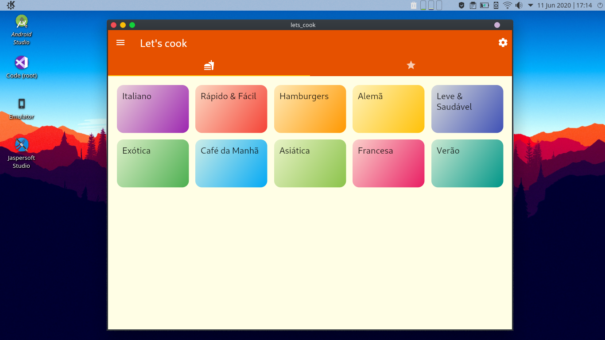

# Let's cook

Aplicativo com receitas organizadas por categoria com recursos de filtros personalizados e favoritos.
Porém ainda sem persistência de dados.

## Demonstração

## Let's cook para Linux
Executável disponível para linux por este <a href="https://github.com/hansmboron/download/blob/master/lets_cook.tar.xz?raw=true" target="_blank" rel="noopener noreferrer"
                                        title="download lets cook"><i>link</i></a>.
Programa criado utilizando o Linux desktop do Flutter que no momento ainda é experimental.
Utilizei o mesmo código acima apenas tirei fora os package google_fonts, <i>cached_network_image</i> e <i>bubble_tab_indicator</i> que ainda não são suportados pelo Flutter Desktop.

Para executar no seu Linux desempacote e execute o arquivo <strong>lets_cook</strong>

